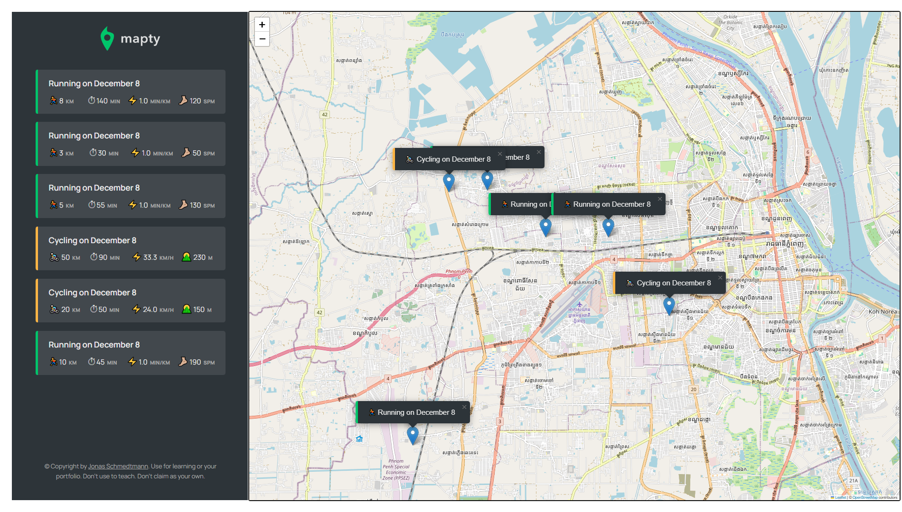

# Mapty App 🗺️💪

Mapty is a web application that allows users to log and map their workouts. Whether you're running or cycling, you can store your workout data in local storage and view your activities on an interactive map.

## 🖼️ Screenshot



---

## 🚀 Features

- 🏃‍♂️ **Log running workouts** with details like distance, duration, and cadence.
- 🚴‍♀️ **Log cycling workouts** with distance, duration, and elevation gain.
- 🗺️ **View workouts on an interactive map** with custom markers.
- 💾 **Store workout data** in local storage to keep track across sessions.

---

## 🛠️ Technologies Used

- 🔤 **HTML**
- 🎨 **CSS**
- 💻 **JavaScript**
- 🗺️ **Leaflet.js** for interactive maps

---

## ⚙️ Setup

To run the project locally:

1. **Clone the repository**:
   ```bash
   git clone https://github.com/BothSann/mapty-app.git

---

## 👨‍💻 Built By

This project was built by **THANN SOPHEAKBOTH** as part of an online learning course by [Jonas Schmedtmann](https://codingheroes.io/).

---

## ©️ Copyright By

© Copyright by **Jonas Schmedtmann**. This project is for educational purposes only and cannot be used for commercial purposes.

